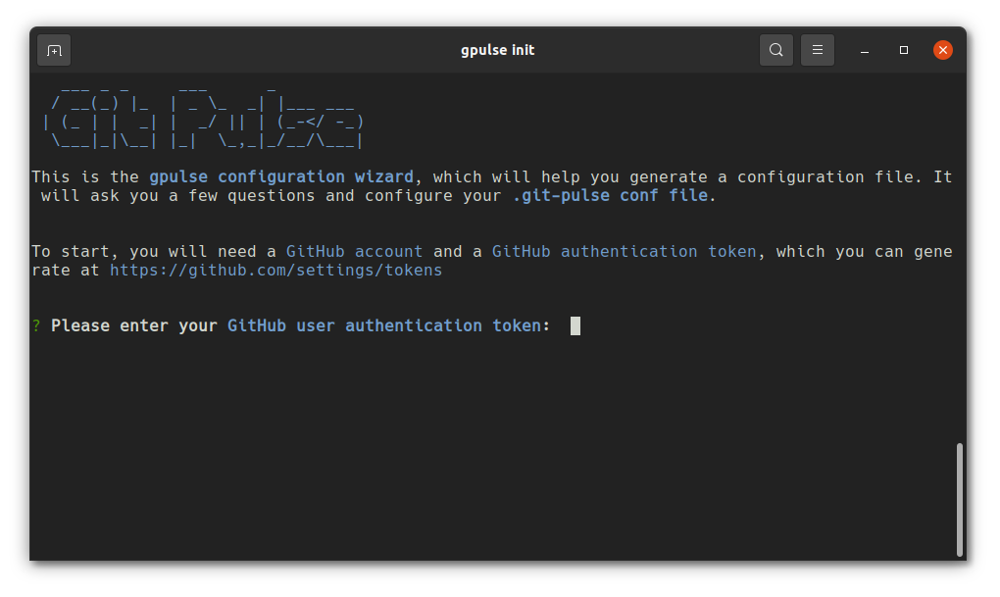
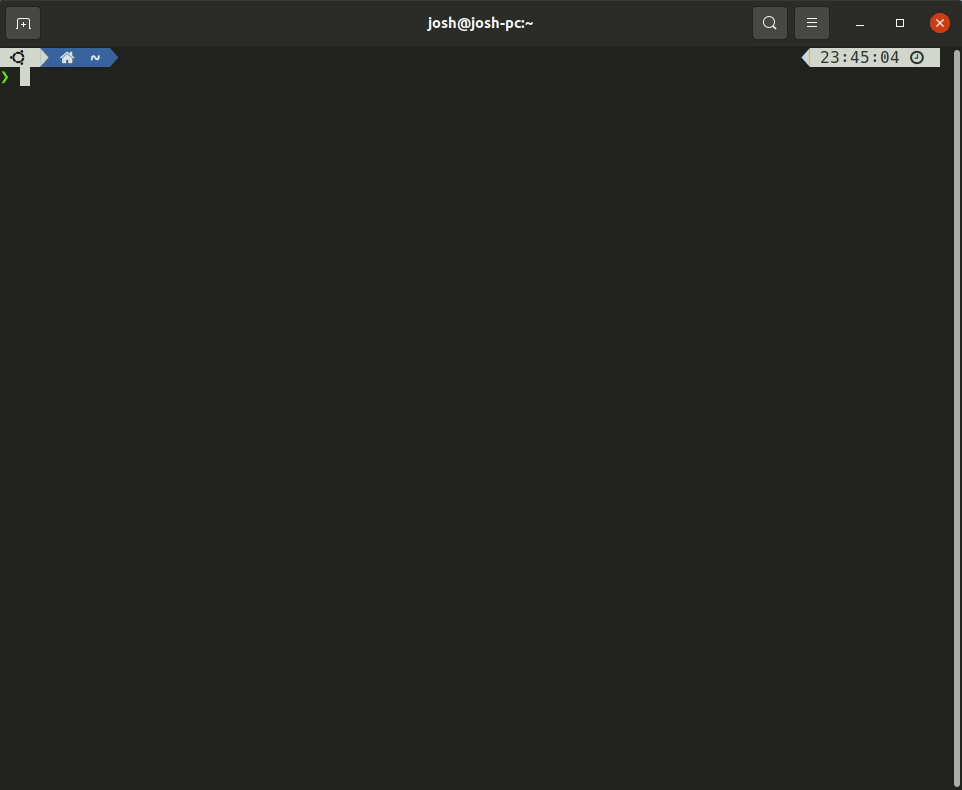
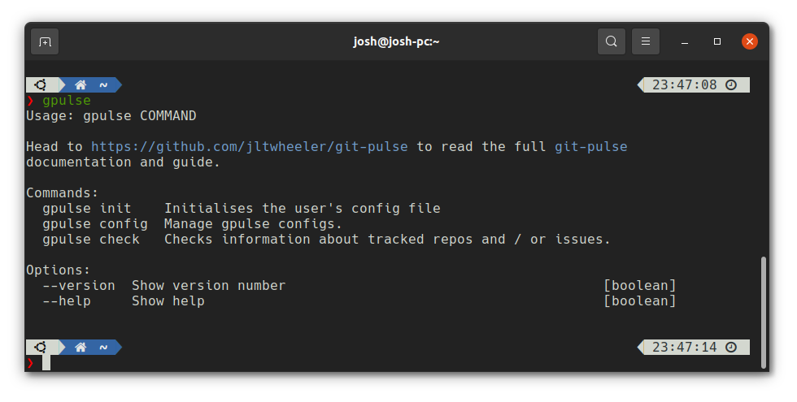

<!-- PROJECT SHIELDS -->
<!--
*** Markdown "reference style" links for readability.
*** Reference links are enclosed in brackets [ ] instead of parentheses ( ).
*** See the bottom of this document for the declaration of the reference variables
*** for contributors-url, forks-url, etc. This is an optional, concise syntax you may use.
*** https://www.markdownguide.org/basic-syntax/#reference-style-links
-->

[![Version][version-shield]][version-url]
[![Build][build-shield]][build-url]
[![Contributors][contributors-shield]][contributors-url]
[![Issues][issues-shield]][issues-url]
[![License][license-shield]][license-url]
[![Code Size][code-size-shield]][code-size-url]

<!-- PROJECT LOGO -->
<br />
<p align="center">
  <a href="https://github.com/jltwheeler/git-pulse">
   
  </a>

  <h3 align="center">Git Pulse</h3>

  <p align="center">Node CLI tool that makes it easy to track GitHub repos and issues of interest.
    <br />
    <br />
    <a href="https://github.com/jltwheeler/git-pulse/issues/new?assignees=&labels=&template=bug_report.md&title=">Report Bug</a>
    |
    <a href="https://github.com/jltwheeler/git-pulse/issues/new?assignees=&labels=&template=feature_request.md&title=">Request Feature</a>
  </p>
</p>

<!-- TABLE OF CONTENTS -->

<details open="open">
  <summary>Table of Contents</summary>
  <ol>
    <li>
      <a href="#about-the-project">About The Project</a>
      <ul>
        <li><a href="#the-need">The Need</a></li>
        <li><a href="#built-with">Build With</a></li>
      </ul>
    </li>
    <li>
      <a href="#getting-started">Getting Started</a>
      <ul>
        <li><a href="#prerequisites">Prerequisites</a></li>
        <li><a href="#installation">Installation</a></li>
      </ul>
    </li>
    <li><a href="#usage">Usage</a></li>
    <li><a href="#contributing">Contributing</a></li>
    <li><a href="#roadmap">Roadmap</a></li>
    <li><a href="#license">License</a></li>
    <li><a href="#contact">Contact</a></li>
    <li><a href="#acknowledgements">Acknowledgements</a></li>
  </ol>
</details>
<br/>

<!-- ABOUT THE PROJECT -->

## About The Project

Git Pulse is a node.js CLI tool which makes it quick and easy to keep up to
date with your favourite repositories and issues.



### The Need

Countless hours have been wasted manually tracking repository releases / version
and issue states. **Git Pulse** now makes it easier to track the repositories
and issues you are interested in by running a simple command:

```sh
gpulse check
```



### Built With

- [yargs](https://www.npmjs.com/package/yargs)
- [inquirer](https://www.npmjs.com/package/inquirer)
- [TypeScript](https://www.typescriptlang.org/)
- [GitHub GraphQL API](https://docs.github.com/en/github-ae@latest/graphql/overview/about-the-graphql-api)
- [graphql-request](https://www.npmjs.com/package/graphql-request)

<!-- GETTING STARTED -->

## Getting Started

To get up and running with **Git Pulse**, follow these simple steps.

### Prerequisites

- [npm](https://nodejs.org/en/download/)
- GitHub account with a valid [authentication token](https://github.com/settings/tokens/new).
  Ensure you select the **repo** scope _at a minium_.

### Installation

1. Install package from npm globally

```sh
npm i -g git-pulse
```

2. Set up your GitHub authentication token. Go to [this link](https://github.com/settings/tokens/new)
   to set up a token for your account.

3. Set up your initial configuration by running `gpulse init` , and follow the
   interactive wizard.

<!-- USAGE EXAMPLES -->

## Usage

> The CLI is invoked using the `gpulse` command rather than `git-pulse`



#### Run the initialise config wizard

`gpulse init`

#### View existing configs

`gpulse config ls [<-r -i>]`

#### Update token in config file

`gpulse config token`

#### Add / remove repository in config file

`gpulse config rm -r <id>`
<br/>
`gpulse config add -r <link/to/repo>`

#### Add / remove issue in config file

`gpulse config rm -i <id>`
<br/>
`gpulse config add -i <link/to/repo>`

#### Check latest repository information

`gpulse check -r`

#### Check latest issues information

`gpulse check -i`

#### Check latest repository and issues information

`gpulse check` or `gpulse check -a`

<!-- CONTRIBUTING -->

## Contributing

Contributions are what make the open source community such an amazing place to
be learn, inspire, and create. Any contributions you make are **greatly
appreciated**.

Please read the [Contribution Guidelines](https://github.com/jltwheeler/git-pulse/blob/main/CONTRIBUTING.md)
before you start making your awesome contributions!

<!-- ROADMAP -->

## Roadmap

See the [open issues](issues-url) for a list of proposed features (and known
issues).

<!-- LICENSE -->

## License

Distributed under the MIT License. See `LICENSE` for more information.

<!-- CONTACT -->

## Contact

Josh Wheeler: jltwheeler@gmail.com

Project Link: [https://github.com/jltwheeler/git-pulse](https://github.com/jltwheeler/git-pulse)

<!-- ACKNOWLEDGEMENTS -->

## Acknowledgements

- [husky](https://www.npmjs.com/package/husky)
- [lint-staged](https://www.npmjs.com/package/lint-staged)

<!-- MARKDOWN LINKS & IMAGES -->
<!-- https://www.markdownguide.org/basic-syntax/#reference-style-links -->

[version-shield]: https://img.shields.io/npm/v/git-pulse?style=for-the-badge
[version-url]: https://www.npmjs.com/package/git-pulse
[build-shield]: https://img.shields.io/github/workflow/status/jltwheeler/git-pulse/Publish%20git-pulse%20to%20npm.?style=for-the-badge
[build-url]: https://github.com/jltwheeler/git-pulse/actions?query=workflow%3A%22Publish+git-pulse+to+npm.%22
[contributors-shield]: https://img.shields.io/github/contributors/jltwheeler/git-pulse.svg?style=for-the-badge
[contributors-url]: https://github.com/jltwheeler/git-pulse/graphs/contributors
[issues-shield]: https://img.shields.io/github/issues-raw/jltwheeler/git-pulse?style=for-the-badge
[issues-url]: https://github.com/jltwheeler/git-pulse/issues
[license-shield]: https://img.shields.io/github/license/jltwheeler/git-pulse.svg?style=for-the-badge
[license-url]: https://github.com/jltwheeler/git-pulse/blob/master/LICENSE
[code-size-shield]: https://img.shields.io/github/languages/code-size/jltwheeler/git-pulse?style=for-the-badge
[code-size-url]: https://github.com/jltwheeler/git-pulse
